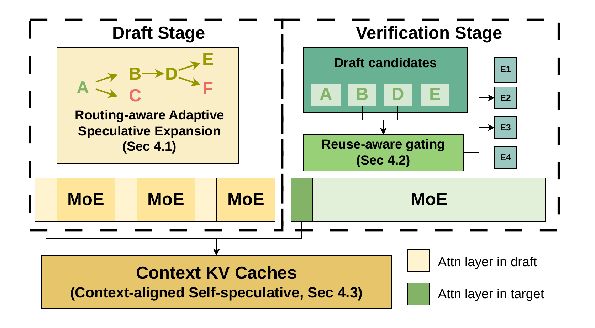
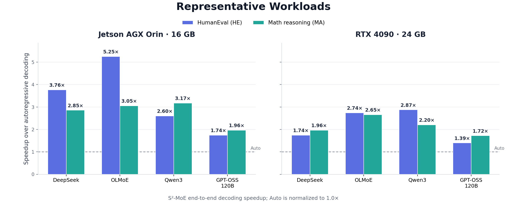

# S²-MoE

### Efficient self-speculative decoding for Mixture-of-Experts models on edge devices

[](paper/s2moe.pdf)
[](https://github.com/angerybob/S2-MoE/tree/orin)
[](https://github.com/angerybob/S2-MoE/tree/4090)
[](LICENSE)

S²-MoE makes speculative decoding practical for memory-constrained MoE inference. It combines routing-aware speculative expansion, reuse-aware gating, and context-aligned self-speculation to reduce both target verification work and off-chip expert traffic.


The animation replays measured OLMoE decoding traces on a Jetson AGX Orin under a 16 GB memory budget. It compares target-only Auto with the full paper implementation; model loading and prefill are excluded from the displayed decoding rate.

## Highlights

- **Up to 5.3× speedup** over target-only autoregressive decoding.
- **About 2.0× average speedup** across the complete evaluation grid.
- Evaluated on **four MoE families**, **seven tasks**, three Orin memory budgets, and an RTX 4090.
- Built directly on `llama.cpp`, including SSD expert offloading and CUDA execution.
- Reproducible paths for S²-MoE, paper baselines, DFlash, and Domino.

## How S²-MoE works

1. **Routing-aware adaptive expansion** grows the draft tree only when the predicted acceptance benefit justifies its expert-transfer cost.
2. **Reuse-aware gating** steers target verification toward useful experts already activated by the draft stage.
3. **Context-aligned self-speculation** shares the target context and KV cache, avoiding an independent full-size draft context.



## Results at a glance



The chart highlights two representative workloads from the complete evaluation: HumanEval code generation (HE) and mathematical reasoning (MA). It reports the paper's end-to-end results for a 16 GB Jetson AGX Orin and a single RTX 4090; Auto is normalized to 1.0×. See the [paper](paper/s2moe.pdf) for all seven tasks and every memory budget.

## Quick start

Use the `orin` branch for Jetson AGX Orin and the `4090` branch for a single RTX 4090.

```bash
git clone https://github.com/angerybob/S2-MoE.git
cd S2-MoE
git checkout orin

cmake -S . -B build \
  -DGGML_CUDA=ON \
  -DCMAKE_CUDA_ARCHITECTURES=87 \
  -DCMAKE_BUILD_TYPE=Release \
  -DLLAMA_BUILD_TESTS=OFF \
  -DLLAMA_BUILD_SERVER=OFF
cmake --build build --target llama-cli llama-speculative -j
```

For RTX 4090, check out `4090` and use `-DCMAKE_CUDA_ARCHITECTURES=89`.

A representative SSD-offloaded S²-MoE run is:

```bash
TARGET=/path/to/split-expert-target.gguf
HOT=/path/to/hot-experts.json
DATASET=/path/to/evaluation.jsonl

./build/bin/llama-speculative \
  -m "$TARGET" --model-draft "$TARGET" \
  --ssd-moe --hot-experts "$HOT" \
  --dataset "$DATASET" --n-questions 5 \
  -n 64 --ignore-eos -c 2048 --temp 1 --min-p 0.01 --top-k 4 -s 42 \
  -ngl 99 -ngld 99 -t 8 --parallel 1 -kvu --no-warmup --no-mmap \
  --draft 8 --draft-p-split 0.1 --draft-share-kv --draft-expert-topk 2 \
  --moe-reuse-strength 0 --moe-reuse-expert-cap 18 --moe-reuse-runtime \
  --prune 1 --prune-max-nodes 512 --prune-max-depth 32 --prune-budget 0 \
  --prune-m-route 8 --prune-k-tgt 8 \
  --prune-beta 0.8 --prune-gamma 2 --prune-lambda 1 \
  --prune-tpot 100 --prune-eps 7.5 \
  --prune-expert-bytes 0.571875 --prune-bandwidth 3.66 \
  --prune-expert-max 384 --prune-score-thresh 1
```

The numeric values above are a representative profiled OLMoE/Orin configuration. Replace the model, resident-expert list, and cost-model values for your hardware. Additional profiled examples are in [the speculative decoder guide](examples/speculative/README.md).

## Integrated baselines

The repository provides runnable paths for the comparison methods used in the paper:

| Method | Runtime path |
| --- | --- |
| Auto | Target-only `llama-cli` decoding |
| ExpertSkip | Sparse self-draft without pruning, reuse gating, or KV sharing |
| LayerSkip | Model-specific layer-skipped drafter |
| EAGLE-3 | Native encoder/decoder draft model with confidence stopping |
| Cascade + EAGLE-3 | EAGLE-3 plus utility-based dynamic draft width |
| S²-MoE | Routing-aware pruning, runtime reuse gating, and shared KV |

See [Baseline and decoder commands](docs/baselines.md) for concise commands and model requirements.

## DFlash and Domino

DFlash and Domino are also integrated as additional speculative decoders. They are reported separately because, under the same edge/offloading setup, their gains were generally smaller and less consistent, with several configurations not outperforming autoregressive decoding. Both use `--spec-type draft-dflash`; a Domino draft GGUF is detected from its metadata and automatically selects the Domino sampling path.

Representative matched measurements on Jetson AGX Orin are shown below; values are speedups over autoregressive decoding:

| Model / memory | DFlash | Domino | S²-MoE |
| --- | ---: | ---: | ---: |
| DeepSeek / 64 GB | 1.32× | 0.87× | **1.60×** |
| OLMoE / 32 GB | 1.23× | 0.82× | **1.87×** |

```bash
./build/bin/llama-speculative \
  -m /path/to/target.gguf \
  -md /path/to/dflash-or-domino-draft.gguf \
  --spec-type draft-dflash \
  --dataset /path/to/evaluation.jsonl --n-questions 5 \
  -ngl 99 -ngld 99 --draft 8 -n 64
```

## Paper and citation

**S²-MoE: Enabling Efficient Self-Speculative Decoding for Mixture-of-Experts on Edge Devices**<br>
Haochen Huang, Shengxuan Qiu, and Meng Li.

```bibtex
@article{huang2026s2moe,
  title   = {S$^2$-MoE: Enabling Efficient Self-Speculative Decoding for Mixture-of-Experts on Edge Devices},
  author  = {Huang, Haochen and Qiu, Shengxuan and Li, Meng},
  year    = {2026}
}
```

## Acknowledgements

This project is built on [llama.cpp](https://github.com/ggml-org/llama.cpp). The implementation retains its MIT license; see [LICENSE](LICENSE).
